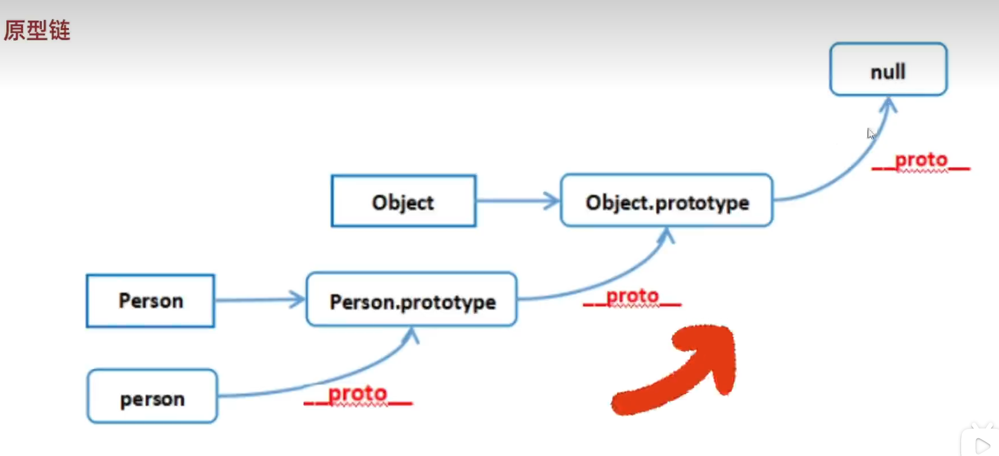

# 收集点面试题(基础篇)

---

## 1. 经典从输入 url 到页面渲染的过程

9 个步骤：完整的参考[连八股文都不懂还指望在前端混下去么](https://juejin.cn/post/7016593221815910408#heading-11)

1. 输入 url
2. 查找 DNS 缓存
    1. 查浏览器缓存
    2. 查操作系统缓存
    3. 查路由器缓存
    4. 查 ISP 缓存
3. 解析 DNS 为 IP
4. 发起 TCP 连接请求
5. 发起 HTTP 请求
6. 服务器响应数据
7. 发起 TCP 断开请求
8. 渲染 DOM
    1. 构建 DOM 树
    2. 构建 CSS 树
    3. 构建 render 树
    4. 排布元素位置
    5. 绘制元素样式
9. 解析 JS

## 2. 数据类型

1. JavaScript 中共有 8 种数据类型，undefined、null、string、number、boolean、object、symbol、bigint。其中 symbol、bigint 是 ES6 新增的。

2. **NaN 属于 number**

3. **原始数据类型有 7 种，除了 object 都是。**

4. 原始数据类型的值是不可变的，这意味着如果对一个原始类型的变量进行修改，实际上是创建了一个新的值。例如，对一个字符串变量进行拼接操作，实际上是创建了一个新的字符串，原来的字符串并没有被改变。

5. typeof null 之所以返回 object，是因为在 JavaScript 的底层对类型都有一个标签码，其中 object 的标签码是 000 ，而 null 表示空指针，类型标签也是 000 ，所以 typeof null 会被判定为 object。

## 3.原型和原型链

1. 原型：**函数** 都有的 `prototype` 属性，称为原型，本身是一个 **对象** 所以也叫原型对象。
2. 原型链：**对象** 都有一个 `__proto__` 属性，这个属性指向了其 **构造函数** 的原型对象，而原型对象也是对象，所以它也有 `__proto__` 属性，它又能找到再上一层构造函数的原型对象，这样 **一层层查找形成的链式结构，称为原型链**，查找到顶层后找不到再上一层则返回 null。

## 4.
