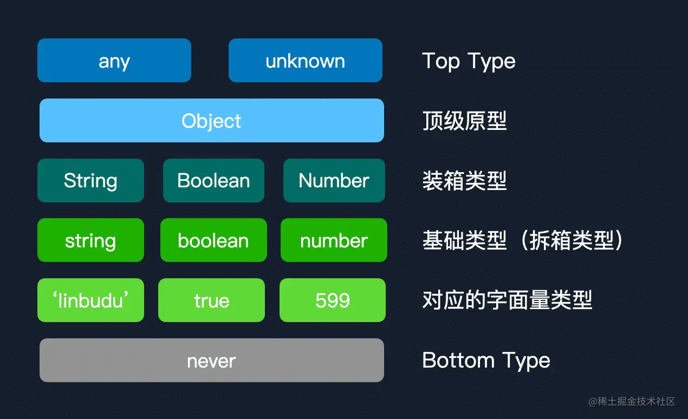

# 类型层级

---

在开始前，我们需要先了解一下如何直观地判断两个类型的兼容性。本节中我们主要使用条件类型来判断类型兼容性，类似这样：

```typescript
type Result = 'linxae' extends string ? 1 : 2;
```

如果返回 1，则说明 `'linxae'` 为 string 的子类型。否则，说明不成立。但注意，不成立并不意味着 string 就是 `'linxae'` 的子类型了。还有一种备选的，通过赋值来进行兼容性检查的方式，其大致使用方式是这样的：

```typescript
declare let source: string;

declare let anyType: any;
declare let neverType: never;

anyType = source;

// 不能将类型“string”分配给类型“never”。
neverType = source;
```

对于变量 a = 变量 b，如果成立，意味着 `<变量 b 的类型> extends <变量 a 的类型>` 成立，即 **b 类型是 a 类型的子类型**，在这里即是 `string extends never` ，这明显是不成立的。

## 1. object Object {}

---

由于结构化类型系统这一特性的存在，我们能得到一些看起来矛盾的结论：

```typescript
type Result16 = {} extends object ? 1 : 2; // 1
type Result18 = object extends {} ? 1 : 2; // 1

type Result17 = object extends Object ? 1 : 2; // 1
type Result20 = Object extends object ? 1 : 2; // 1

type Result19 = Object extends {} ? 1 : 2; // 1
type Result21 = {} extends Object ? 1 : 2; // 1
```

16-18 和 19-21 这两对，为什么无论如何判断都成立？难道说明 `{}` 和 object 类型相等，也和 `Object` 类型一致？

当然不，这里的 `{} extends `和 `extends {}` 实际上是两种完全不同的比较方式。`{} extends object` 和 `{} extends Object` 意味着， `{}` 是 object 和 Object 的字面量类型，是从**类型信息的层面**出发的，即**字面量类型在基础类型之上提供了更详细的类型信息**。`object extends {}` 和 `Object extends {}` 则是从**结构化类型系统的比较**出发的，即 `{}` 作为一个一无所有的空对象，几乎可以被视作是所有类型的基类，万物的起源。如果混淆了这两种类型比较的方式，就可能会得到 `string extends object` 这样的错误结论。

而 `object extends Object` 和 `Object extends object` 这两者的情况就要特殊一些，它们是因为“系统设定”的问题，Object 包含了所有除 Top Type 以外的类型（基础类型、函数类型等），object 包含了所有非原始类型的类型，即数组、对象与函数类型，这就导致了你中有我、我中有你的神奇现象。

## 2. 类型层级链

---

结合我们上面得到的结论，可以书写出这样一条类型层级链：

```typescript
type TypeChain = never extends 'linxae'
  	? 'linxae' extends 'linxae' | '599'
  	? 'linxae' | '599' extends string
  	? string extends String
  	? String extends Object
  	? Object extends any
  	? any extends unknown
  	? unknown extends any
  	? 8
  	: 7
  	: 6
  	: 5
  	: 4
  	: 3
  	: 2
  	: 1
  	: 0
```

其返回的结果为 8 ，也就意味着所有条件均成立。当然，结合上面的结构化类型系统与类型系统设定，我们还可以构造出一条更长的类型层级链：

```typescript
type VerboseTypeChain = never extends 'linxae'
  	? 'linxae' extends 'linxae' | 'budulin'
  	? 'linxae' | 'budulin' extends string
  	? string extends {}
  	? string extends String
  	? String extends {}
  	? {} extends object
  	? object extends {}
  	? {} extends Object
  	? Object extends {}
  	? object extends Object
  	? Object extends object
  	? Object extends any
  	? Object extends unknown
  	? any extends unknown
  	? unknown extends any
  	? 8
  	: 7
  	: 6
  	: 5
  	: 4
  	: 3
  	: 2
  	: 1
  	: 0
  	: -1
  	: -2
  	: -3
  	: -4
  	: -5
  	: -6
  	: -7
  	: -8
```

结果仍然为 8 。

## 3. 总结图

---

基础的类型层级可以用以下这张图表示：

